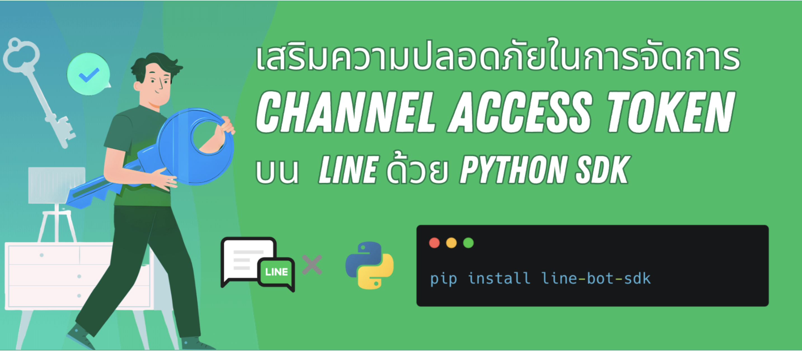
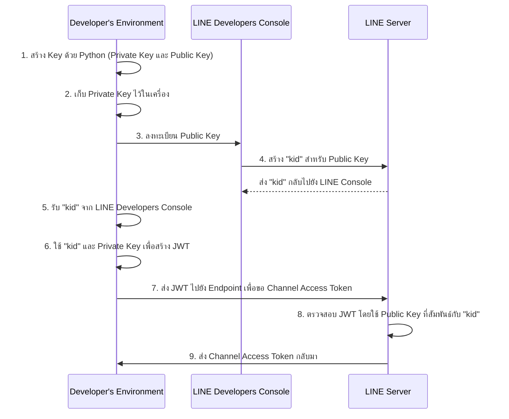
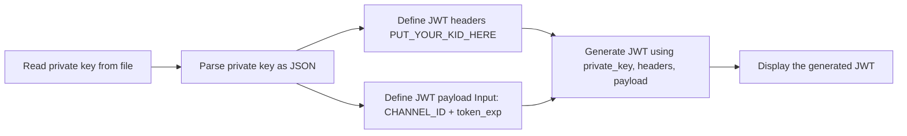
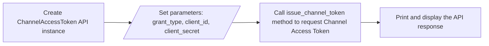

# Manage LINE Channel Access Token using Python 

```mermaid
sequenceDiagram
  participant DevEnv as Developer's Environment 
  participant LINEConsole as LINE Developers Console
  participant LINEServer as LINE Server
  DevEnv ->> DevEnv: 1. สร้าง​ Key ด้วย Python (Private Key และ Public Key)
  DevEnv ->> DevEnv: 2. เก็บ Private Key ไว้ในเครื่อง
  DevEnv ->> LINEConsole: 3. ลงทะเบียน Public Key 
  LINEConsole ->> LINEServer: 4. สร้าง "kid" สำหรับ Public Key
  LINEServer -->> LINEConsole: ส่ง "kid" กลับไปยัง LINE Console
  DevEnv ->> DevEnv: 5. รับ "kid" จาก LINE Developers Console
  DevEnv ->> DevEnv: 6. ใช้ "kid" และ Private Key เพื่อสร้าง JWT
  DevEnv ->> LINEServer: 7. ส่ง JWT ไปยัง Endpoint เพื่อขอ Channel Access Token
  LINEServer ->> LINEServer: 8. ตรวจสอบ JWT โดยใช้ Public Key ที่สัมพันธ์กับ "kid"
  LINEServer ->> DevEnv: 9. ส่ง Channel Access Token กลับมา
```

```mermaid 
flowchart LR
    B["Read private key from file"] --> C["Parse private key as JSON"]
    C --> D["Define JWT headers PUT_YOUR_KID_HERE"] & E["Define JWT payload Input: CHANNEL_ID + token_exp"]
    D --> F["Generate JWT using private_key, headers, payload"]
    E --> F
    F --> G["Display the generated JWT"]
```

```mermaid
flowchart LR
    E["Create ChannelAccessToken API instance"] --> 
    F["Set parameters: grant_type, client_id, client_secret"]
    F --> G["Call issue_channel_token method to request Channel Access Token"]
    G --> H["Print and display the API response"] 
    F@{ shape: lean-r}
```